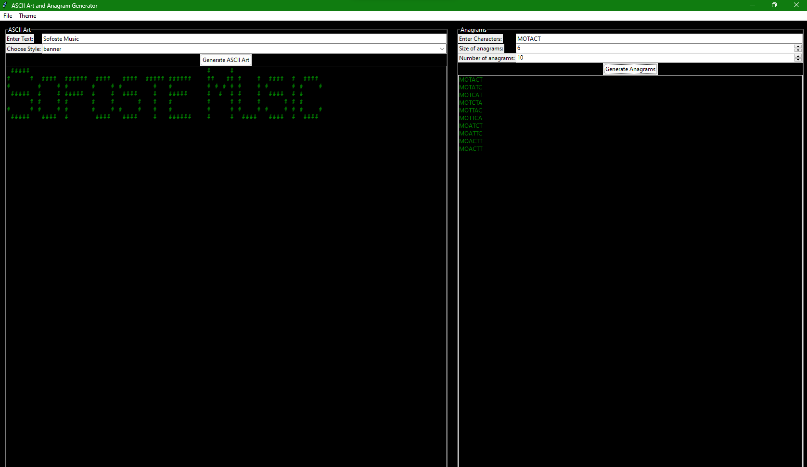
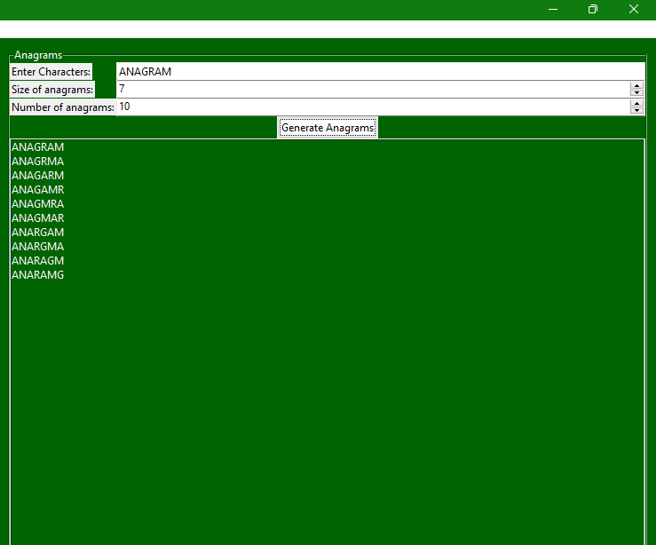
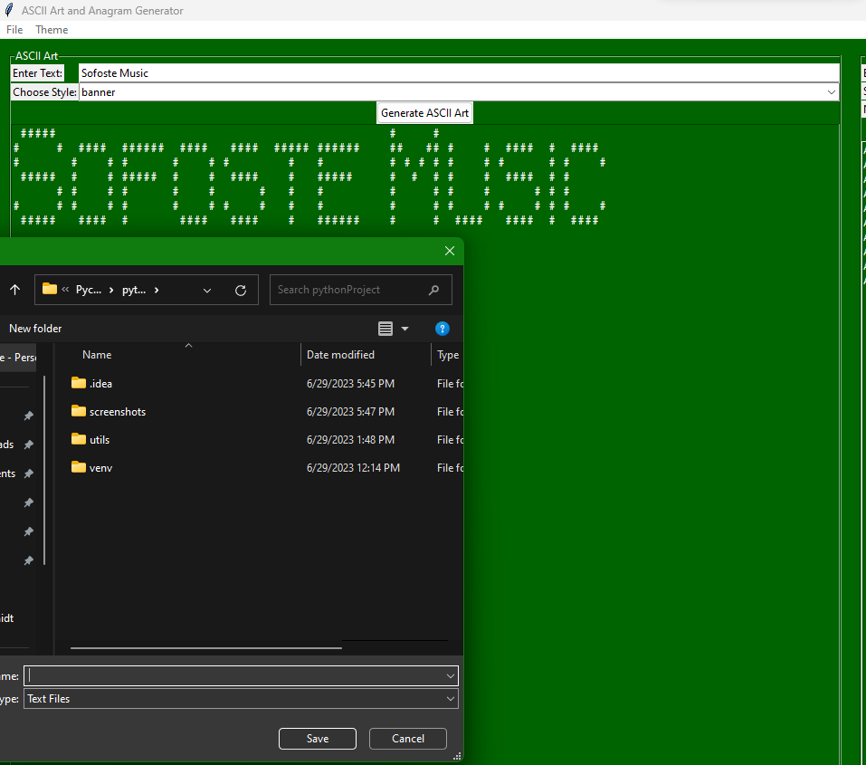
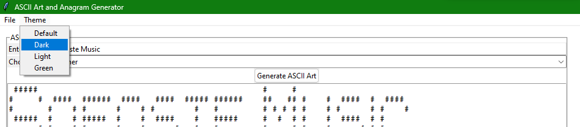

# Sofoste-AAaG
# ASCII Art and Anagram Generator

Hello there, dear reader!

Welcome to ASCII Art and Anagram Generator, a fun, intuitive, and easy-to-use Python program that turns your input text into mesmerizing ASCII Art or generates exciting anagrams based on your chosen parameters. Developed with a keen focus on user interaction and readability, this program opens a world of artistic and linguistic exploration at your fingertips!

## Key Features

* ** * 
* **ASCII Art Generation:** Transform any text into ASCII Art in a variety of styles, from the classic 'block' to the avant-garde 'lean'. Watch as your words take on a new form and come alive!
* 
* **Anagram Creation:** Give your brain a workout with our Anagram Generator. Enter your choice of characters, choose the size and the number of anagrams you'd like to generate, and voilà! Uncover the hidden words and let the linguistic fun begin!
* 
* **Interactive GUI:** Featuring a user-friendly interface designed with Tkinter, it allows for easy navigation and offers a seamless experience, even for beginners.
* 
* **Theming Support:** Choose from a variety of built-in themes such as Dark Mode, Light Mode, Green Dark, and more, to match your aesthetic preference and make the application a visual treat!
* 

## How to Use

Clone the repository and run the `main.py` file. Interact with the simple dialog boxes to input your text for ASCII Art or characters for anagram generation, and let the program do the rest!

## Contribute and Collaborate

We're excited to have you on board! This project is open to suggestions, modifications, and improvements. Feel free to clone, fork, or download the repository and bring in your valuable contributions. Open a pull request or an issue, and let's make this project even more awesome!

## About the Developer

This project was developed by [@sofoste93](https://github.com/sofoste93), a passionate developer with an affinity for interactive and user-centric applications. Feel free to connect!

Remember, your creativity is the limit! Get started with ASCII Art and Anagram Generator today and dive into a world of artistic expression and linguistic fun. Happy Coding!

_**NOTE:** This application is a work in progress, with room for further enhancements and features. Your suggestions and contributions are most welcome._
